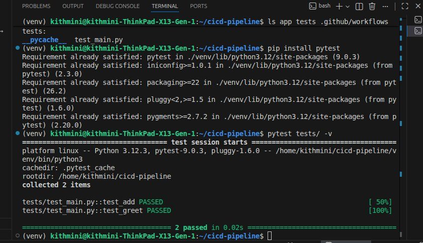
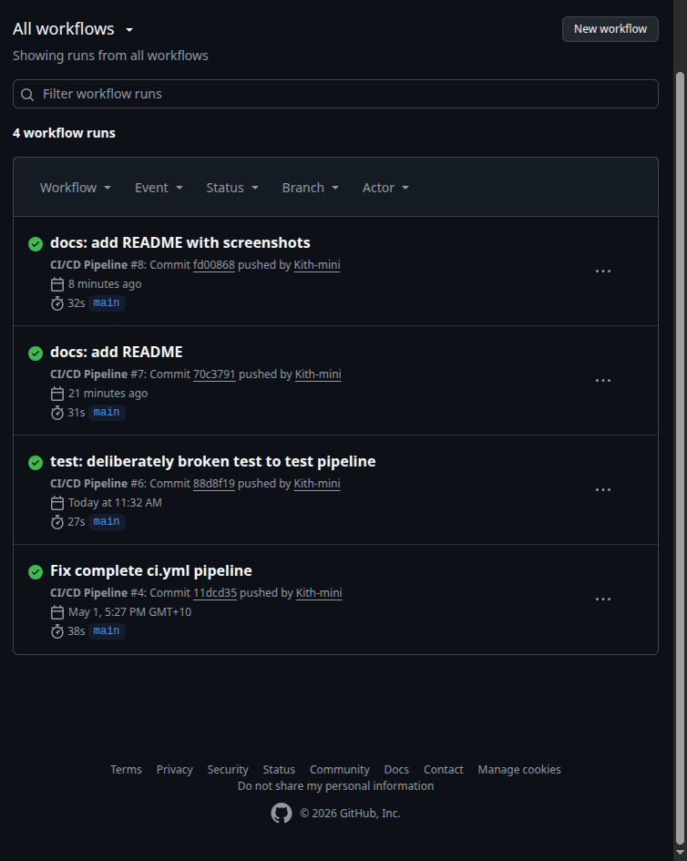
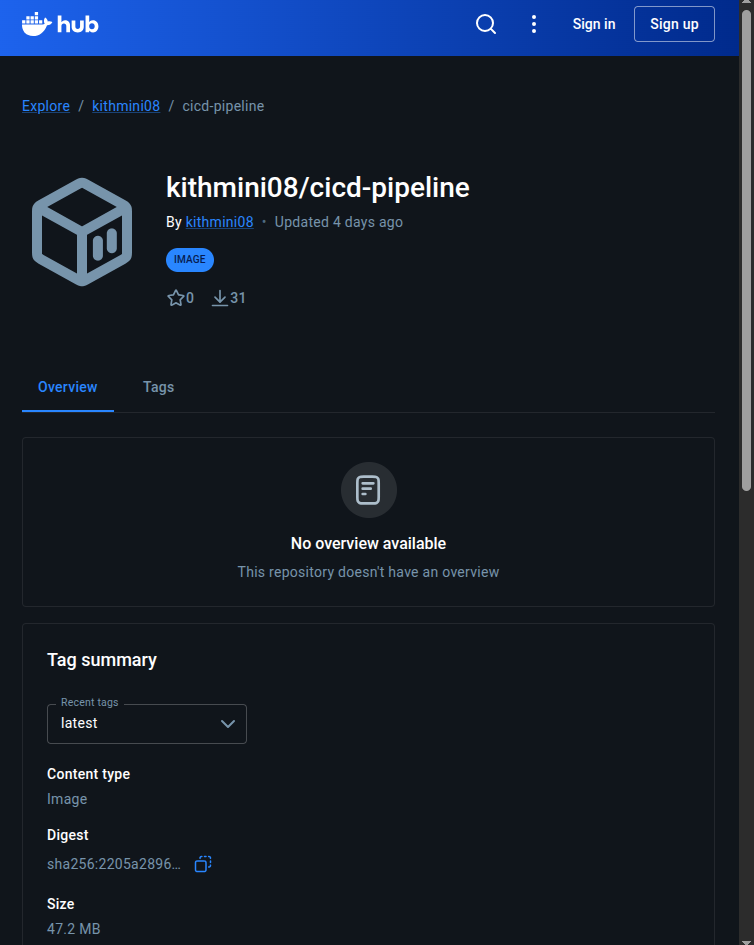
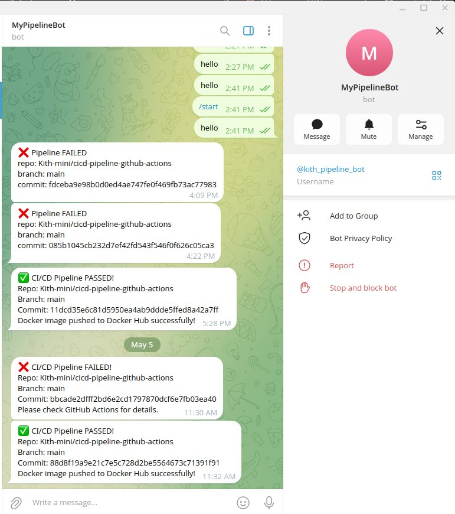

# CI/CD Pipeline


A fully automated CI/CD pipeline that tests Python code, builds a Docker image, pushes it to Docker Hub, and sends a Telegram notification — all triggered by a single `git push`.

---

## Pipeline Overview

```
git push → pytest → docker build → docker push → Telegram notify
```

Every push to `main` triggers the full pipeline automatically. If tests fail, the pipeline stops — no broken image ever reaches Docker Hub.

| Stage | Tool | What happens |
|---|---|---|
| Test | pytest | All tests run. Failure stops the pipeline. |
| Build | Docker | App packaged into a portable image. |
| Push | Docker Hub | Tested image pushed to registry. |
| Notify | Telegram API | Pass or fail message sent instantly. |

---

## Stack

| Tool | Purpose |
|---|---|
| GitHub Actions | Pipeline runner — triggers on every push to main |
| pytest | Automated test runner — gates the Docker build |
| Docker | Containerises the Python application |
| Docker Hub | Cloud registry — stores the built image |
| Telegram API | Sends instant pass/fail notifications |
| Python 3.12 | Application language |

---

## Project Structure

```
cicd-pipeline-github-actions/
├── app/
│   └── main.py                   # Application code
├── tests/
│   └── test_main.py              # pytest test suite
├── .github/
│   └── workflows/
│       └── ci.yml                # Pipeline definition
├── docs/
│   └── screenshots/              # Project screenshots
├── Dockerfile                    # Container build recipe
└── requirements.txt              # Python dependencies
```

---

## Screenshots

### pytest passing locally



Both tests pass in 0.02s before a single line is pushed to GitHub.

---

### GitHub Actions — pipeline complete



Green checkmark. Full pipeline — test, build, push, notify — completed in **38 seconds**.

---

### Docker Hub — image pushed



Image `kithmini08/cicd-pipeline:latest` live on Docker Hub. 47.2 MB. 31 pulls.

---

### Telegram notifications — pass and fail



Every pipeline run sends an instant message. Failures are caught before any broken image reaches Docker Hub.

---

## Pipeline Definition

The full pipeline lives in `.github/workflows/ci.yml`:

```yaml
name: CI/CD Pipeline

on:
  push:
    branches: [ main ]

jobs:
  build-test-push:
    runs-on: ubuntu-latest

    steps:
      - name: Checkout code
        uses: actions/checkout@v4

      - name: Set up Python
        uses: actions/setup-python@v5
        with:
          python-version: '3.12'

      - name: Install dependencies
        run: pip install -r requirements.txt

      - name: Run tests
        run: pytest tests/ -v

      - name: Log in to Docker Hub
        if: success()
        uses: docker/login-action@v3
        with:
          username: ${{ secrets.DOCKER_USERNAME }}
          password: ${{ secrets.DOCKER_PASSWORD }}

      - name: Build Docker image
        if: success()
        run: docker build -t ${{ secrets.DOCKER_USERNAME }}/cicd-pipeline:latest .

      - name: Push Docker image
        if: success()
        run: docker push ${{ secrets.DOCKER_USERNAME }}/cicd-pipeline:latest

      - name: Notify Telegram — success
        if: success()
        run: |
          curl -s -X POST "https://api.telegram.org/bot${{ secrets.TELEGRAM_TOKEN }}/sendMessage" \
            -d chat_id="${{ secrets.TELEGRAM_CHAT_ID }}" \
            -d text="✅ CI/CD Pipeline PASSED%0ARepo: ${{ github.repository }}%0ABranch: ${{ github.ref_name }}%0ACommit: ${{ github.sha }}%0ADocker image pushed to Docker Hub successfully!"

      - name: Notify Telegram — failure
        if: failure()
        run: |
          curl -s -X POST "https://api.telegram.org/bot${{ secrets.TELEGRAM_TOKEN }}/sendMessage" \
            -d chat_id="${{ secrets.TELEGRAM_CHAT_ID }}" \
            -d text="❌ CI/CD Pipeline FAILED%0ARepo: ${{ github.repository }}%0ABranch: ${{ github.ref_name }}%0ACommit: ${{ github.sha }}%0APlease check GitHub Actions for details."
```

---

## Setup

### Prerequisites

- Python 3.12+
- Docker
- GitHub account
- Docker Hub account
- Telegram bot token and chat ID

### 1. Clone the repository

```bash
git clone https://github.com/Kith-mini/cicd-pipeline-github-actions.git
cd cicd-pipeline-github-actions
```

### 2. Create a virtual environment and install dependencies

```bash
python3 -m venv venv
source venv/bin/activate
pip install -r requirements.txt
```

### 3. Run tests locally

```bash
pytest tests/ -v
```

### 4. Build and run the Docker image locally

```bash
docker build -t cicd-pipeline .
docker run cicd-pipeline
```

### 5. Add GitHub Secrets

Go to your repo → **Settings** → **Secrets and variables** → **Actions** and add:

| Secret | Value |
|---|---|
| `DOCKER_USERNAME` | Your Docker Hub username |
| `DOCKER_PASSWORD` | Your Docker Hub password |
| `TELEGRAM_TOKEN` | Your Telegram bot token from @BotFather |
| `TELEGRAM_CHAT_ID` | Your Telegram chat ID |

### 6. Push to trigger the pipeline

```bash
git add .
git commit -m "your message"
git push origin main
```

The pipeline runs automatically. Check the **Actions** tab for live output and your Telegram for the result.

---

## Docker Image

The built image is available on Docker Hub:

```bash
docker pull kithmini08/cicd-pipeline:latest
docker run kithmini08/cicd-pipeline:latest
```

---

## Telegram Notifications

Every pipeline run sends a message to Telegram:

**On success:**
```
✅ CI/CD Pipeline PASSED
Repo: Kith-mini/cicd-pipeline-github-actions
Branch: main
Commit: abc123...
Docker image pushed to Docker Hub successfully!
```

**On failure:**
```
❌ CI/CD Pipeline FAILED
Repo: Kith-mini/cicd-pipeline-github-actions
Branch: main
Commit: abc123...
Please check GitHub Actions for details.
```

---

## Results

| Metric | Result |
|---|---|
| Pipeline duration | 38 seconds |
| Tests | 2 passing |
| Docker image size | 47.2 MB |
| Docker Hub pulls | 31+ |
| Notifications | Instant on pass and fail |

---

## Key Design Decisions

**Tests gate the Docker build.** The `if: success()` condition on every Docker step means a failing test immediately stops the pipeline. A broken image can never reach Docker Hub.

**Dependency layer caching.** The Dockerfile copies `requirements.txt` and runs `pip install` before copying the application code. Docker reuses the dependency layer on every build unless requirements change — significantly faster builds.

**Secrets never in code.** All credentials are stored as GitHub Secrets and injected at runtime as `${{ secrets.NAME }}`. They are masked as `***` in all log output and never visible in the repository.

**Dual notification steps.** Two separate Telegram steps — one with `if: success()` and one with `if: failure()` — ensure a notification is always sent regardless of where the pipeline fails.

---

## License

MIT